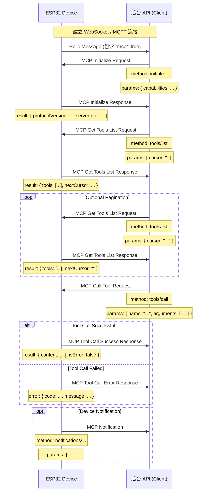

# MCP (Model Context Protocol) Etkileşim Akışı

NOT: AI desteğiyle oluşturulmuştur. Arka uç servisi uygulanırken ayrıntıları koddan doğrulayın.

Bu projede MCP protokolü, arka uç API'si (MCP istemcisi) ile ESP32 cihazı (MCP sunucusu) arasındaki iletişim için kullanılır. Böylece arka uç, cihazın sunduğu özellikleri (araçları) keşfedebilir ve çağırabilir.

## Protokol Formatı

Koda göre (`main/protocols/protocol.cc`, `main/mcp_server.cc`), MCP mesajları WebSocket veya MQTT gibi temel iletişim protokollerinin mesaj gövdesi içinde taşınır. İç yapı [JSON-RPC 2.0](https://www.jsonrpc.org/specification) standardını izler.

Genel mesaj yapısı örneği:

```json
{
  "session_id": "...", // 会话 ID
  "type": "mcp",       // 消息类型，固定为 "mcp"
  "payload": {         // JSON-RPC 2.0 负载
    "jsonrpc": "2.0",
    "method": "...",   // 方法名 (如 "initialize", "tools/list", "tools/call")
    "params": { ... }, // 方法参数 (对于 request)
    "id": ...,         // 请求 ID (对于 request 和 response)
    "result": { ... }, // 方法执行结果 (对于 success response)
    "error": { ... }   // 错误信息 (对于 error response)
  }
}
```

`payload` alanı standart bir JSON-RPC 2.0 mesajıdır:

- `jsonrpc`: Sabit `"2.0"` değeri.
- `method`: Çağrılacak yöntem adı (Request için).
- `params`: Yöntem parametreleri; genellikle nesne biçiminde yapılandırılmış bir değer (Request için).
- `id`: İstek kimliği. İstemci gönderir, sunucu yanıtta aynı değeri döndürür; istek ve yanıtı eşleştirmek için kullanılır.
- `result`: Yöntem başarılı çalıştığında dönen sonuç (Success Response için).
- `error`: Yöntem başarısız olduğunda dönen hata bilgisi (Error Response için).

## Etkileşim Akışı ve Gönderim Zamanı

MCP etkileşimi temelde istemcinin (arka uç API'si) cihaz üzerindeki araçları keşfetmesi ve çağırması üzerine kuruludur.

1.  **Bağlantı Kurulumu ve Yetenek Bildirimi**

    - **Zaman:** Cihaz başlatılıp arka uç API'sine başarıyla bağlandıktan sonra.
    - **Gönderen:** Cihaz.
    - **Mesaj:** Cihaz, temel protokolün `"hello"` mesajını arka uç API'sine gönderir. Mesajda cihazın desteklediği yetenekler yer alır; örneğin MCP desteği için `"mcp": true`.
    - **Örnek (MCP payload değil, temel protokol mesajıdır):**
      ```json
      {
        "type": "hello",
        "version": ...,
        "features": {
          "mcp": true,
          ...
        },
        "transport": "websocket", // 或 "mqtt"
        "audio_params": { ... },
        "session_id": "..." // 设备收到服务器hello后可能设置
      }
      ```

2.  **MCP Oturumunu Başlatma**

    - **Zaman:** Arka uç API'si cihazdan `"hello"` mesajını alıp cihazın MCP desteklediğini doğruladıktan sonra. Genellikle MCP oturumunun ilk isteği olarak gönderilir.
    - **Gönderen:** Arka uç API'si (istemci).
    - **Yöntem:** `initialize`
    - **Mesaj (MCP payload):**

      ```json
      {
        "jsonrpc": "2.0",
        "method": "initialize",
        "params": {
          "capabilities": {
            // 客户端能力，可选

            // 摄像头视觉相关
            "vision": {
              "url": "...", //摄像头: 图片处理地址(必须是http地址, 不是websocket地址)
              "token": "..." // url token
            }

            // ... 其他客户端能力
          }
        },
        "id": 1 // 请求 ID
      }
      ```

    - **Cihazın yanıt zamanı:** Cihaz `initialize` isteğini alıp işledikten sonra.
    - **Cihaz yanıtı (MCP payload):**
      ```json
      {
        "jsonrpc": "2.0",
        "id": 1, // 匹配请求 ID
        "result": {
          "protocolVersion": "2024-11-05",
          "capabilities": {
            "tools": {} // 这里的 tools 似乎不列出详细信息，需要 tools/list
          },
          "serverInfo": {
            "name": "...", // 设备名称 (BOARD_NAME)
            "version": "..." // 设备固件版本
          }
        }
      }
      ```

3.  **Cihaz Araç Listesini Keşfetme**

    - **Zaman:** Arka uç API'si cihazın o anda desteklediği özelliklerin (araçların) listesini ve çağrı biçimini almak istediğinde.
    - **Gönderen:** Arka uç API'si (istemci).
    - **Yöntem:** `tools/list`
    - **Mesaj (MCP payload):**
      ```json
      {
        "jsonrpc": "2.0",
        "method": "tools/list",
        "params": {
          "cursor": "" // 用于分页，首次请求为空字符串
        },
        "id": 2 // 请求 ID
      }
      ```
    - **Cihazın yanıt zamanı:** Cihaz `tools/list` isteğini alıp araç listesini oluşturduktan sonra.
    - **Cihaz yanıtı (MCP payload):**
      ```json
      {
        "jsonrpc": "2.0",
        "id": 2, // 匹配请求 ID
        "result": {
          "tools": [ // 工具对象列表
            {
              "name": "self.get_device_status",
              "description": "...",
              "inputSchema": { ... } // 参数 schema
            },
            {
              "name": "self.audio_speaker.set_volume",
              "description": "...",
              "inputSchema": { ... } // 参数 schema
            }
            // ... 更多工具
          ],
          "nextCursor": "..." // 如果列表很大需要分页，这里会包含下一个请求的 cursor 值
        }
      }
      ```
    - **Sayfalama:** `nextCursor` alanı boş değilse istemci yeniden `tools/list` isteği gönderir ve sonraki araç sayfasını almak için `params` içinde bu `cursor` değerini taşır.

4.  **Cihaz Aracını Çağırma**

    - **Zaman:** Arka uç API'si cihaz üzerindeki belirli bir özelliği çalıştırmak istediğinde.
    - **Gönderen:** Arka uç API'si (istemci).
    - **Yöntem:** `tools/call`
    - **Mesaj (MCP payload):**
      ```json
      {
        "jsonrpc": "2.0",
        "method": "tools/call",
        "params": {
          "name": "self.audio_speaker.set_volume", // 要调用的工具名称
          "arguments": {
            // 工具参数，对象格式
            "volume": 50 // 参数名及其值
          }
        },
        "id": 3 // 请求 ID
      }
      ```
    - **Cihazın yanıt zamanı:** Cihaz `tools/call` isteğini alıp ilgili araç fonksiyonunu çalıştırdıktan sonra.
    - **Başarılı cihaz yanıtı (MCP payload):**
      ```json
      {
        "jsonrpc": "2.0",
        "id": 3, // 匹配请求 ID
        "result": {
          "content": [
            // 工具执行结果内容
            { "type": "text", "text": "true" } // 示例：set_volume 返回 bool
          ],
          "isError": false // 表示成功
        }
      }
      ```
    - **Başarısız cihaz yanıtı (MCP payload):**
      ```json
      {
        "jsonrpc": "2.0",
        "id": 3, // 匹配请求 ID
        "error": {
          "code": -32601, // JSON-RPC 错误码，例如 Method not found (-32601)
          "message": "Unknown tool: self.non_existent_tool" // 错误描述
        }
      }
      ```

5.  **Cihazın Kendiliğinden Mesaj Göndermesi (Notifications)**
    - **Zaman:** Cihaz içinde arka uç API'sine bildirilmesi gereken bir olay oluştuğunda. Örneğin durum değişimi. Kod örneğinde bu tür mesaj gönderen belirgin bir araç olmasa da `Application::SendMcpMessage`, cihazın MCP mesajlarını kendiliğinden gönderebileceğini gösterir.
    - **Gönderen:** Cihaz (sunucu).
    - **Yöntem:** `notifications/` ile başlayan bir yöntem adı veya başka bir özel yöntem olabilir.
    - **Mesaj (MCP payload):** JSON-RPC Notification biçimini izler ve `id` alanı içermez.
      ```json
      {
        "jsonrpc": "2.0",
        "method": "notifications/state_changed", // 示例方法名
        "params": {
          "newState": "idle",
          "oldState": "connecting"
        }
        // 没有 id 字段
      }
      ```
    - **Arka uç API işlemi:** Notification alındıktan sonra arka uç API ilgili işlemi yapar, ancak yanıt göndermez.

## Etkileşim Diyagramı

Aşağıdaki sadeleştirilmiş sıra diyagramı temel MCP mesaj akışını gösterir:



Bu belge, projedeki MCP protokolünün temel etkileşim akışını özetler. Parametre ayrıntıları ve araç işlevleri için `main/mcp_server.cc` içindeki `McpServer::AddCommonTools` ve her aracın gerçek uygulaması referans alınmalıdır.
