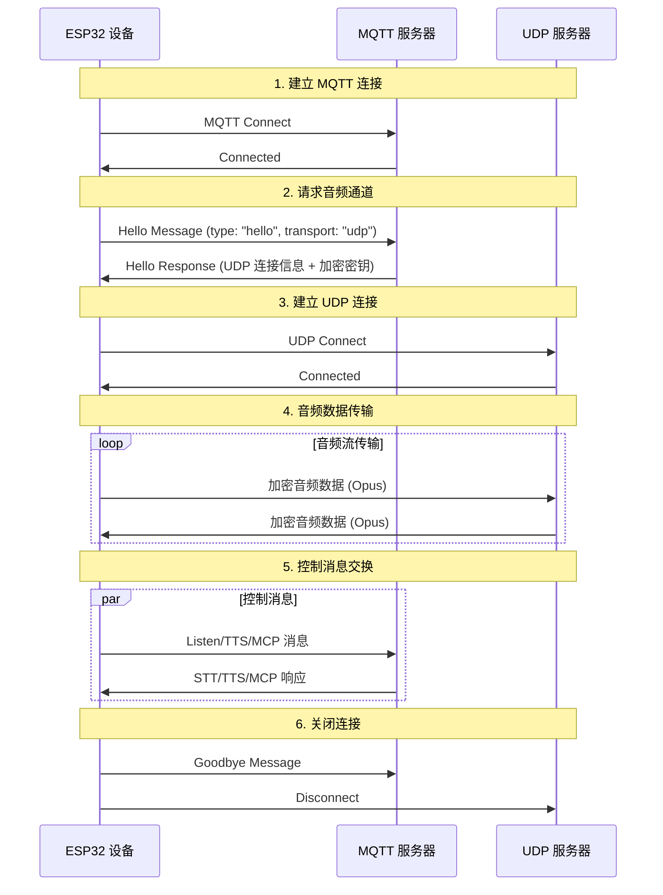
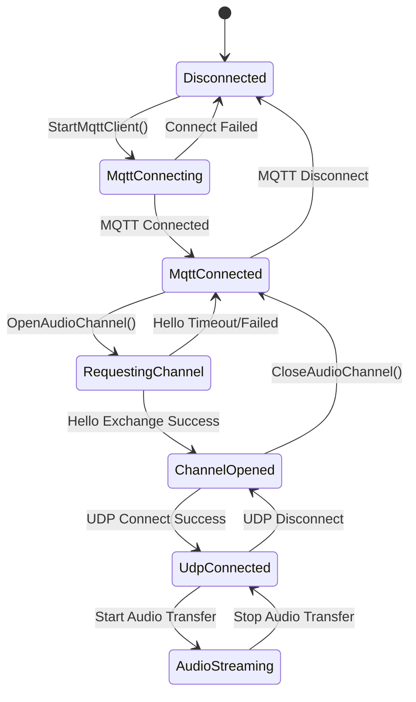

# MQTT + UDP Karma İletişim Protokolü

Bu belge, kod uygulamasına göre hazırlanmış MQTT + UDP karma iletişim protokolü özetidir. Cihaz ile sunucunun kontrol mesajlarını MQTT üzerinden, ses verisini ise UDP üzerinden nasıl aktardığını açıklar.

---

## 1. Protokol Genel Bakışı

Bu protokol karma aktarım modeli kullanır:
- **MQTT**: Kontrol mesajları, durum senkronizasyonu ve JSON veri alışverişi için kullanılır.
- **UDP**: Gerçek zamanlı ses verisi aktarımı için kullanılır ve şifrelemeyi destekler.

### 1.1 Protokol Özellikleri

- **Çift kanal tasarımı**: Kontrol ve veri kanalları ayrıdır; bu gerçek zamanlılığı korur.
- **Şifreli aktarım**: UDP ses verisi AES-CTR ile şifrelenir.
- **Sıra numarası koruması**: Paket tekrarı ve sıra bozulmasına karşı koruma sağlar.
- **Otomatik yeniden bağlantı**: MQTT bağlantısı koptuğunda otomatik yeniden bağlanır.

---

## 2. Genel Akış



---

## 3. MQTT Kontrol Kanalı

### 3.1 Bağlantı Kurulumu

Cihaz MQTT ile sunucuya bağlanır. Bağlantı parametreleri şunlardır:
- **Endpoint**: MQTT sunucu adresi ve portu.
- **Client ID**: Cihaza ait benzersiz kimlik.
- **Username/Password**: Kimlik doğrulama bilgileri.
- **Keep Alive**: Kalp atışı aralığı (varsayılan 240 saniye).

### 3.2 Hello Mesaj Alışverişi

#### 3.2.1 Cihazın Hello Göndermesi

```json
{
  "type": "hello",
  "version": 3,
  "transport": "udp",
  "features": {
    "mcp": true
  },
  "audio_params": {
    "format": "opus",
    "sample_rate": 16000,
    "channels": 1,
    "frame_duration": 60
  }
}
```

#### 3.2.2 Sunucunun Hello Yanıtı

```json
{
  "type": "hello",
  "transport": "udp",
  "session_id": "xxx",
  "audio_params": {
    "format": "opus",
    "sample_rate": 24000,
    "channels": 1,
    "frame_duration": 60
  },
  "udp": {
    "server": "192.168.1.100",
    "port": 8888,
    "key": "0123456789ABCDEF0123456789ABCDEF",
    "nonce": "0123456789ABCDEF0123456789ABCDEF"
  }
}
```

**Alan açıklamaları:**
- `udp.server`: UDP sunucu adresi.
- `udp.port`: UDP sunucu portu.
- `udp.key`: AES şifreleme anahtarı (onaltılık string).
- `udp.nonce`: AES nonce değeri (onaltılık string).

### 3.3 JSON Mesaj Türleri

#### 3.3.1 Cihaz → Sunucu

1. **Listen Mesajı**
   ```json
   {
     "session_id": "xxx",
     "type": "listen",
     "state": "start",
     "mode": "manual"
   }
   ```

2. **Abort Mesajı**
   ```json
   {
     "session_id": "xxx",
     "type": "abort",
     "reason": "wake_word_detected"
   }
   ```

3. **MCP Mesajı**
   ```json
   {
     "session_id": "xxx",
     "type": "mcp",
     "payload": {
       "jsonrpc": "2.0",
       "id": 1,
       "result": {...}
     }
   }
   ```

4. **Goodbye Mesajı**
   ```json
   {
     "session_id": "xxx",
     "type": "goodbye"
   }
   ```

#### 3.3.2 Sunucu → Cihaz

Desteklenen mesaj türleri WebSocket protokolüyle aynıdır:
- **STT**: Ses tanıma sonucu.
- **TTS**: Ses sentezi kontrolü.
- **LLM**: Duygu/ifade kontrolü.
- **MCP**: IoT kontrolü.
- **System**: Sistem kontrolü.
- **Custom**: Özel mesaj (isteğe bağlı).

---

## 4. UDP Ses Kanalı

### 4.1 Bağlantı Kurulumu

Cihaz MQTT Hello yanıtını aldıktan sonra içindeki UDP bağlantı bilgileriyle ses kanalını kurar:
1. UDP sunucu adresini ve portunu ayrıştırır.
2. Şifreleme anahtarını ve nonce değerini ayrıştırır.
3. AES-CTR şifreleme bağlamını başlatır.
4. UDP bağlantısını kurar.

### 4.2 Ses Verisi Formatı

#### 4.2.1 Şifreli Ses Paketi Yapısı

```
|type 1byte|flags 1byte|payload_len 2bytes|ssrc 4bytes|timestamp 4bytes|sequence 4bytes|
|payload payload_len bytes|
```

**Alan açıklamaları:**
- `type`: Paket türü; sabit değer 0x01.
- `flags`: Bayrak alanı; şu anda kullanılmıyor.
- `payload_len`: Payload uzunluğu (network byte order).
- `ssrc`: Senkronizasyon kaynağı kimliği.
- `timestamp`: Zaman damgası (network byte order).
- `sequence`: Sıra numarası (network byte order).
- `payload`: Şifrelenmiş Opus ses verisi.

#### 4.2.2 Şifreleme Algoritması

Şifreleme için **AES-CTR** modu kullanılır:
- **Anahtar**: 128 bit, sunucu tarafından sağlanır.
- **Nonce**: 128 bit, sunucu tarafından sağlanır.
- **Sayaç**: Zaman damgası ve sıra numarası bilgisini içerir.

### 4.3 Sıra Numarası Yönetimi

- **Gönderici**: `local_sequence_` tek yönlü artar.
- **Alıcı**: `remote_sequence_` sürekliliği doğrular.
- **Tekrar koruması**: Beklenen değerden küçük sıra numarasına sahip paketler reddedilir.
- **Hata toleransı**: Küçük sıra numarası sıçramalarına izin verilir ve uyarı kaydedilir.

### 4.4 Hata İşleme

1. **Şifre çözme hatası**: Hata kaydedilir, paket atılır.
2. **Sıra numarası anormalliği**: Uyarı kaydedilir, paket yine de işlenir.
3. **Paket formatı hatası**: Hata kaydedilir, paket atılır.

---

## 5. Durum Yönetimi

### 5.1 Bağlantı Durumu



### 5.2 Durum Kontrolü

Cihaz ses kanalının kullanılabilir olup olmadığını aşağıdaki koşulla değerlendirir:
```cpp
bool IsAudioChannelOpened() const {
    return udp_ != nullptr && !error_occurred_ && !IsTimeout();
}
```

---

## 6. Yapılandırma Parametreleri

### 6.1 MQTT Yapılandırması

Ayarlar içinden okunan yapılandırma alanları:
- `endpoint`: MQTT sunucu adresi.
- `client_id`: İstemci kimliği.
- `username`: Kullanıcı adı.
- `password`: Parola.
- `keepalive`: Kalp atışı aralığı (varsayılan 240 saniye).
- `publish_topic`: Yayın konusu.

### 6.2 Ses Parametreleri

- **Format**: Opus.
- **Örnekleme oranı**: 16000 Hz (cihaz tarafı) / 24000 Hz (sunucu tarafı).
- **Kanal sayısı**: 1 (mono).
- **Kare süresi**: 60 ms.

---

## 7. Hata İşleme ve Yeniden Bağlantı

### 7.1 MQTT Yeniden Bağlantı Mekanizması

- Bağlantı başarısız olduğunda otomatik yeniden dener.
- Hata raporlama kontrolünü destekler.
- Bağlantı koptuğunda temizlik akışı tetiklenir.

### 7.2 UDP Bağlantı Yönetimi

- Bağlantı başarısız olduğunda otomatik yeniden deneme yapmaz.
- Yeniden anlaşma için MQTT kanalına bağlıdır.
- Bağlantı durumu sorgulamayı destekler.

### 7.3 Zaman Aşımı İşleme

Temel `Protocol` sınıfı zaman aşımı denetimi sağlar:
- Varsayılan zaman aşımı: 120 saniye.
- Son alma zamanına göre hesaplanır.
- Zaman aşımında otomatik olarak kullanılamaz işaretlenir.

---

## 8. Güvenlik Notları

### 8.1 Aktarım Şifrelemesi

- **MQTT**: TLS/SSL şifrelemeyi destekler (port 8883).
- **UDP**: Ses verisi için AES-CTR şifreleme kullanır.

### 8.2 Kimlik Doğrulama Mekanizması

- **MQTT**: Kullanıcı adı/parola doğrulaması.
- **UDP**: Anahtarlar MQTT kanalı üzerinden dağıtılır.

### 8.3 Tekrar Saldırısı Koruması

- Sıra numarası tek yönlü artar.
- Süresi geçmiş paketler reddedilir.
- Zaman damgası doğrulanır.

---

## 9. Performans İyileştirme

### 9.1 Eşzamanlılık Kontrolü

UDP bağlantısı mutex ile korunur:
```cpp
std::lock_guard<std::mutex> lock(channel_mutex_);
```

### 9.2 Bellek Yönetimi

- Ağ nesneleri dinamik olarak oluşturulur ve yok edilir.
- Ses paketleri akıllı işaretçilerle yönetilir.
- Şifreleme bağlamı zamanında serbest bırakılır.

### 9.3 Ağ İyileştirme

- UDP bağlantısı yeniden kullanılır.
- Paket boyutu optimize edilir.
- Sıra numarası sürekliliği kontrol edilir.

---

## 10. WebSocket Protokolüyle Karşılaştırma

| Özellik | MQTT + UDP | WebSocket |
|------|------------|-----------|
| Kontrol kanalı | MQTT | WebSocket |
| Ses kanalı | UDP (şifreli) | WebSocket (binary) |
| Gerçek zamanlılık | Yüksek (UDP) | Orta |
| Güvenilirlik | Orta | Yüksek |
| Karmaşıklık | Yüksek | Düşük |
| Şifreleme | AES-CTR | TLS |
| Güvenlik duvarı uyumu | Düşük | Yüksek |

---

## 11. Dağıtım Önerileri

### 11.1 Ağ Ortamı

- UDP portunun erişilebilir olduğundan emin olun.
- Güvenlik duvarı kurallarını yapılandırın.
- NAT geçişini değerlendirin.

### 11.2 Sunucu Yapılandırması

- MQTT Broker yapılandırması.
- UDP sunucu dağıtımı.
- Anahtar yönetim sistemi.

### 11.3 İzleme Metrikleri

- Bağlantı başarı oranı.
- Ses aktarım gecikmesi.
- Paket kayıp oranı.
- Şifre çözme hata oranı.

---

## 12. Özet

MQTT + UDP karma protokolü, verimli ses iletişimini şu tasarımlarla sağlar:

- **Ayrılmış mimari**: Kontrol ve veri kanalları ayrı görevler üstlenir.
- **Şifreleme koruması**: AES-CTR, ses verisinin güvenli aktarımını sağlar.
- **Sıra yönetimi**: Tekrar saldırılarını ve veri sırası bozulmalarını önler.
- **Otomatik toparlanma**: Bağlantı kesildikten sonra otomatik yeniden bağlantıyı destekler.
- **Performans iyileştirmesi**: UDP aktarımı, ses verisinin gerçek zamanlılığını korur.

Bu protokol, gerçek zamanlılık ihtiyacı yüksek sesli etkileşim senaryolarına uygundur; ancak ağ karmaşıklığı ile aktarım performansı arasında dikkatli bir denge kurulmalıdır.
