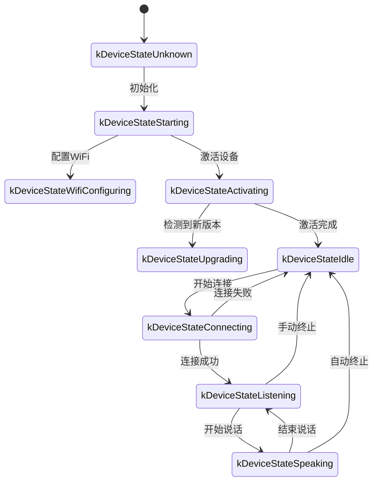
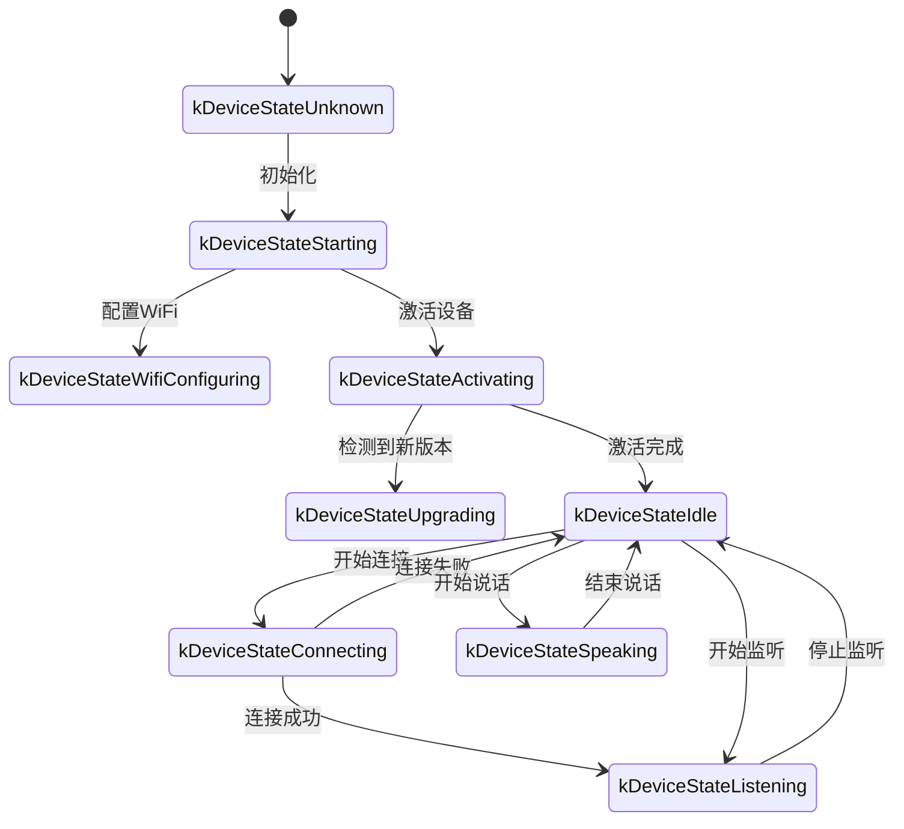

Bu belge, kod uygulamasına göre hazırlanmış WebSocket iletişim protokolü dokümanıdır. Cihaz ile sunucunun WebSocket üzerinden nasıl etkileştiğini özetler.

Bu doküman yalnızca sağlanan koddaki çıkarımlara dayanır. Gerçek dağıtımda sunucu tarafı uygulamasıyla birlikte doğrulama veya ekleme gerekebilir.

---

## 1. Genel Akış

1. **Cihaz tarafı başlatma**
   - Cihaz açılır ve `Application` başlatılır:
     - Ses codec'i, ekran, LED vb. bileşenler hazırlanır.
     - Ağa bağlanılır.
     - `Protocol` arayüzünü uygulayan WebSocket protokol örneği (`WebsocketProtocol`) oluşturulur ve başlatılır.
   - Ana döngüye girilir ve olaylar beklenir (ses girişi, ses çıkışı, zamanlanmış görevler vb.).

2. **WebSocket bağlantısını kurma**
   - Cihaz bir ses oturumu başlatmak istediğinde (örneğin uyandırma veya manuel düğme tetikleme), `OpenAudioChannel()` çağrılır:
     - Yapılandırmadan WebSocket URL'si alınır.
     - Gerekli istek başlıkları ayarlanır (`Authorization`, `Protocol-Version`, `Device-Id`, `Client-Id`).
     - `Connect()` çağrılarak sunucuyla WebSocket bağlantısı kurulur.

3. **Cihazın `"hello"` mesajı göndermesi**
   - Bağlantı başarılı olduktan sonra cihaz aşağıdaki yapıda bir JSON mesajı gönderir:
   ```json
   {
     "type": "hello",
     "version": 1,
     "features": {
       "mcp": true
     },
     "transport": "websocket",
     "audio_params": {
       "format": "opus",
       "sample_rate": 16000,
       "channels": 1,
       "frame_duration": 60
     }
   }
   ```
   - `features` alanı isteğe bağlıdır ve içerik cihazın derleme yapılandırmasına göre otomatik oluşturulur. Örneğin `"mcp": true`, MCP protokol desteğini belirtir.
   - `frame_duration` değeri `OPUS_FRAME_DURATION_MS` ile eşleşir (örneğin 60 ms).

4. **Sunucunun `"hello"` yanıtı**
   - Cihaz, sunucudan `"type": "hello"` içeren bir JSON mesajı bekler ve `"transport": "websocket"` değerinin eşleştiğini kontrol eder.
   - Sunucu isteğe bağlı olarak `session_id` alanını gönderebilir; cihaz bu alanı aldığında otomatik kaydeder.
   - Örnek:
   ```json
   {
     "type": "hello",
     "transport": "websocket",
     "session_id": "xxx",
     "audio_params": {
       "format": "opus",
       "sample_rate": 24000,
       "channels": 1,
       "frame_duration": 60
     }
   }
   ```
   - Eşleşme doğruysa sunucu hazır kabul edilir ve ses kanalının başarıyla açıldığı işaretlenir.
   - Zaman aşımı süresi içinde (varsayılan 10 saniye) doğru yanıt alınmazsa bağlantı başarısız kabul edilir ve ağ hatası callback'i tetiklenir.

5. **Sonraki mesaj etkileşimi**
   - Cihaz ve sunucu arasında iki ana veri türü gönderilebilir:
     1. **İkili ses verisi** (Opus kodlamalı).
     2. **Metin JSON mesajları** (sohbet durumu, TTS/STT olayları, MCP protokol mesajları vb. için).

   - Kod içinde alma callback'i temel olarak şu şekilde ayrılır:
     - `OnData(...)`:
       - `binary` değeri `true` ise mesaj ses karesi kabul edilir; cihaz bunu Opus verisi olarak çözer.
       - `binary` değeri `false` ise mesaj JSON metni kabul edilir; cihaz tarafında cJSON ile ayrıştırılır ve ilgili iş mantığı çalıştırılır (sohbet, TTS, MCP protokol mesajları vb.).

   - Sunucu veya ağ bağlantısı koptuğunda `OnDisconnected()` callback'i tetiklenir:
     - Cihaz `on_audio_channel_closed_()` çağırır ve sonunda boşta durumuna döner.

6. **WebSocket bağlantısını kapatma**
   - Cihaz ses oturumunu sonlandırmak istediğinde `CloseAudioChannel()` çağırarak bağlantıyı kapatır ve boşta durumuna döner.
   - Sunucu bağlantıyı kendisi kapatırsa aynı callback akışı çalışır.

---

## 2. Genel İstek Başlıkları

WebSocket bağlantısı kurulurken kod örneğinde aşağıdaki istek başlıkları ayarlanır:

- `Authorization`: Erişim belirtecini taşır; biçimi `"Bearer <token>"` şeklindedir.
- `Protocol-Version`: Protokol sürüm numarasıdır; hello mesaj gövdesindeki `version` alanıyla uyumlu olmalıdır.
- `Device-Id`: Cihazın fiziksel ağ kartı MAC adresi.
- `Client-Id`: Yazılım tarafından oluşturulan UUID. NVS silinirse veya tam firmware yeniden yazılırsa sıfırlanır.

Bu başlıklar WebSocket el sıkışmasıyla birlikte sunucuya gönderilir. Sunucu ihtiyaca göre doğrulama ve kimlik denetimi yapabilir.

---

## 3. İkili Protokol Sürümleri

Cihaz birden fazla ikili protokol sürümünü destekler. Kullanılacak sürüm yapılandırmadaki `version` alanıyla belirlenir:

### 3.1 Sürüm 1 (varsayılan)
Ek metadata olmadan doğrudan Opus ses verisi gönderir. WebSocket protokolü text ve binary mesajları ayırır.

### 3.2 Sürüm 2
`BinaryProtocol2` yapısını kullanır:
```c
struct BinaryProtocol2 {
    uint16_t version;        // 协议版本
    uint16_t type;           // 消息类型 (0: OPUS, 1: JSON)
    uint32_t reserved;       // 保留字段
    uint32_t timestamp;      // 时间戳（毫秒，用于服务器端AEC）
    uint32_t payload_size;   // 负载大小（字节）
    uint8_t payload[];       // 负载数据
} __attribute__((packed));
```

### 3.3 Sürüm 3
`BinaryProtocol3` yapısını kullanır:
```c
struct BinaryProtocol3 {
    uint8_t type;            // 消息类型
    uint8_t reserved;        // 保留字段
    uint16_t payload_size;   // 负载大小
    uint8_t payload[];       // 负载数据
} __attribute__((packed));
```

---

## 4. JSON Mesaj Yapısı

WebSocket metin kareleri JSON olarak taşınır. Aşağıda yaygın `"type"` değerleri ve ilgili iş mantıkları yer alır. Mesajda burada listelenmeyen alanlar varsa bunlar isteğe bağlı veya belirli uygulama ayrıntıları olabilir.

### 4.1 Cihaz → Sunucu

1. **Hello**
   - Bağlantı başarılı olduktan sonra cihaz tarafından gönderilir ve temel parametreleri sunucuya bildirir.
   - Örnek:
     ```json
     {
       "type": "hello",
       "version": 1,
       "features": {
         "mcp": true
       },
       "transport": "websocket",
       "audio_params": {
         "format": "opus",
         "sample_rate": 16000,
         "channels": 1,
         "frame_duration": 60
       }
     }
     ```

2. **Listen**
   - Cihazın kayıt dinlemeyi başlattığını veya durdurduğunu belirtir.
   - Yaygın alanlar:
     - `"session_id"`: Oturum kimliği.
     - `"type": "listen"`
     - `"state"`: `"start"`, `"stop"`, `"detect"` (uyandırma algılaması tetiklendi).
     - `"mode"`: `"auto"`, `"manual"` veya `"realtime"`; tanıma modunu belirtir.
   - Örnek: dinlemeyi başlatma
     ```json
     {
       "session_id": "xxx",
       "type": "listen",
       "state": "start",
       "mode": "manual"
     }
     ```

3. **Abort**
   - Geçerli konuşmayı (TTS oynatma) veya ses kanalını sonlandırır.
   - Örnek:
     ```json
     {
       "session_id": "xxx",
       "type": "abort",
       "reason": "wake_word_detected"
     }
     ```
   - `reason` değeri `"wake_word_detected"` veya başka bir değer olabilir.

4. **Wake Word Detected**
   - Cihazın uyandırma kelimesinin algılandığını sunucuya bildirmesi için kullanılır.
   - Bu mesajdan önce uyandırma kelimesine ait Opus ses verisi gönderilebilir; sunucu bunu ses izi doğrulaması için kullanabilir.
   - Örnek:
     ```json
     {
       "session_id": "xxx",
       "type": "listen",
       "state": "detect",
       "text": "你好小明"
     }
     ```

5. **MCP**
   - IoT kontrolü için önerilen yeni nesil protokoldür. Cihaz yetenek keşfi ve araç çağrıları gibi işlemler `type: "mcp"` mesajlarıyla yapılır; `payload` içinde standart JSON-RPC 2.0 bulunur (ayrıntılar için [MCP protokol dokümanı](./mcp-protocol.md)).

   - **Cihazdan sunucuya result gönderme örneği:**
     ```json
     {
       "session_id": "xxx",
       "type": "mcp",
       "payload": {
         "jsonrpc": "2.0",
         "id": 1,
         "result": {
           "content": [
             { "type": "text", "text": "true" }
           ],
           "isError": false
         }
       }
     }
     ```

---

### 4.2 Sunucu → Cihaz

1. **Hello**
   - Sunucunun döndürdüğü el sıkışma onay mesajıdır.
   - `"type": "hello"` ve `"transport": "websocket"` içermelidir.
   - Sunucunun beklediği ses parametrelerini veya cihazla hizalı yapılandırmayı belirtmek için `audio_params` içerebilir.
   - Sunucu isteğe bağlı olarak `session_id` alanını gönderebilir; cihaz bunu aldığında otomatik kaydeder.
   - Başarıyla alındığında cihaz WebSocket kanalının hazır olduğunu belirten olay bayrağını ayarlar.

2. **STT**
   - `{"session_id": "xxx", "type": "stt", "text": "..."}`
   - Sunucunun kullanıcı konuşmasını tanıdığını belirtir (örneğin konuşmadan metne sonucu).
   - Cihaz bu metni ekranda gösterebilir ve ardından yanıt akışına geçebilir.

3. **LLM**
   - `{"session_id": "xxx", "type": "llm", "emotion": "happy", "text": "😀"}`
   - Sunucu, cihazın yüz animasyonunu veya UI ifadesini ayarlamasını ister.

4. **TTS**
   - `{"session_id": "xxx", "type": "tts", "state": "start"}`: Sunucu TTS sesini göndermeye hazırlanır; cihaz `"speaking"` oynatma durumuna geçer.
   - `{"session_id": "xxx", "type": "tts", "state": "stop"}`: Bu TTS çıktısının bittiğini belirtir.
   - `{"session_id": "xxx", "type": "tts", "state": "sentence_start", "text": "..."}`
     - Cihazın arayüzde oynatılacak veya okunacak metin parçasını göstermesini sağlar.

5. **MCP**
   - Sunucu, `type: "mcp"` mesajlarıyla IoT kontrol komutları gönderir veya çağrı sonuçlarını döndürür. `payload` yapısı yukarıdakiyle aynıdır.

   - **Sunucudan cihaza tools/call gönderme örneği:**
     ```json
     {
       "session_id": "xxx",
       "type": "mcp",
       "payload": {
         "jsonrpc": "2.0",
         "method": "tools/call",
         "params": {
           "name": "self.light.set_rgb",
           "arguments": { "r": 255, "g": 0, "b": 0 }
         },
         "id": 1
       }
     }
     ```

6. **System**
   - Sistem kontrol komutudur; genellikle uzaktan güncelleme veya yükseltme için kullanılır.
   - Örnek:
     ```json
     {
       "session_id": "xxx",
       "type": "system",
       "command": "reboot"
     }
     ```
   - Desteklenen komutlar:
     - `"reboot"`: Cihazı yeniden başlatır.

7. **Custom** (isteğe bağlı)
   - Özel mesajdır; `CONFIG_RECEIVE_CUSTOM_MESSAGE` etkin olduğunda desteklenir.
   - Örnek:
     ```json
     {
       "session_id": "xxx",
       "type": "custom",
       "payload": {
         "message": "自定义内容"
       }
     }
     ```

8. **Ses verisi: ikili kareler**
   - Sunucu Opus kodlamalı ikili ses karesi gönderdiğinde cihaz bunu çözer ve oynatır.
   - Cihaz `"listening"` (kayıt) durumundaysa çakışmayı önlemek için alınan ses kareleri yok sayılabilir veya temizlenebilir.

---

## 5. Ses Kodlama ve Çözme

1. **Cihazın kayıt verisini göndermesi**
   - Ses girişi, varsa yankı giderme, gürültü azaltma veya ses seviyesi kazancı işlemlerinden geçer; ardından Opus ile kodlanıp ikili kare olarak sunucuya gönderilir.
   - Protokol sürümüne göre Opus verisi doğrudan gönderilebilir (sürüm 1) veya metadata içeren ikili protokol kullanılabilir (sürüm 2/3).

2. **Cihazın aldığı sesi oynatması**
   - Sunucudan gelen ikili kareler Opus verisi kabul edilir.
   - Cihaz veriyi çözer ve ses çıkış arayüzü üzerinden oynatır.
   - Sunucu ses örnekleme oranı cihazla uyumlu değilse çözme sonrasında yeniden örnekleme yapılır.

---

## 6. Yaygın Durum Geçişleri

Aşağıda WebSocket mesajlarıyla ilişkili yaygın cihaz durumu geçişleri yer alır:

1. **Idle** → **Connecting**
   - Kullanıcı tetiklediğinde veya cihaz uyandığında `OpenAudioChannel()` çağrılır → WebSocket bağlantısı kurulur → `"type":"hello"` gönderilir.

2. **Connecting** → **Listening**
   - Bağlantı başarıyla kurulduktan sonra `SendStartListening(...)` çalışırsa kayıt durumuna geçilir. Bu sırada cihaz mikrofon verisini sürekli kodlayıp sunucuya gönderir.

3. **Listening** → **Speaking**
   - Sunucudan TTS Start mesajı (`{"type":"tts","state":"start"}`) alınır → kayıt durdurulur ve alınan ses oynatılır.

4. **Speaking** → **Idle**
   - Sunucu TTS Stop (`{"type":"tts","state":"stop"}`) gönderir → ses oynatma biter. Otomatik dinleme devam etmiyorsa Idle durumuna dönülür; otomatik döngü yapılandırılmışsa yeniden Listening durumuna geçilir.

5. **Listening** / **Speaking** → **Idle** (hata veya manuel kesinti)
   - `SendAbortSpeaking(...)` veya `CloseAudioChannel()` çağrılır → oturum kesilir → WebSocket kapanır → durum Idle olur.

### Otomatik Mod Durum Diyagramı



### Manuel Mod Durum Diyagramı



---

## 7. Hata İşleme

1. **Bağlantı hatası**
   - `Connect(url)` başarısız dönerse veya sunucu `"hello"` mesajı beklenirken zaman aşımı oluşursa `on_network_error_()` callback'i tetiklenir. Cihaz "servise bağlanılamıyor" benzeri bir hata gösterebilir.

2. **Sunucunun bağlantıyı kesmesi**
   - WebSocket beklenmedik şekilde kesilirse `OnDisconnected()` callback'i çalışır:
     - Cihaz `on_audio_channel_closed_()` callback'ini çağırır.
     - Idle durumuna veya başka bir yeniden deneme akışına geçer.

---

## 8. Diğer Notlar

1. **Kimlik doğrulama**
   - Cihaz `Authorization: Bearer <token>` başlığını ayarlayarak kimlik doğrulama bilgisini sağlar; sunucu bunun geçerli olup olmadığını denetlemelidir.
   - Belirteç süresi dolmuş veya geçersizse sunucu el sıkışmasını reddedebilir ya da bağlantıyı sonradan kesebilir.

2. **Oturum kontrolü**
   - Koddaki bazı mesajlar `session_id` içerir. Bu alan ayrı konuşma veya işlemleri ayırmak için kullanılır. Sunucu gerekirse farklı oturumları ayrı işleyebilir.

3. **Ses payload'u**
   - Kod varsayılan olarak Opus formatını, `sample_rate = 16000` değerini ve mono kanalı kullanır. Kare süresi `OPUS_FRAME_DURATION_MS` ile kontrol edilir ve genellikle 60 ms'dir. Bant genişliği veya performansa göre ayarlanabilir. Daha iyi müzik oynatma etkisi için sunucudan gelen ses 24000 örnekleme oranını kullanabilir.

4. **Protokol sürümü yapılandırması**
   - İkili protokol sürümü ayarlardaki `version` alanıyla yapılandırılır (1, 2 veya 3).
   - Sürüm 1: Opus verisini doğrudan gönderir.
   - Sürüm 2: Zaman damgalı ikili protokol kullanır; sunucu tarafı AEC için uygundur.
   - Sürüm 3: Sadeleştirilmiş ikili protokol kullanır.

5. **IoT kontrolü için önerilen protokol: MCP**
   - Cihaz ile sunucu arasındaki IoT yetenek keşfi, durum senkronizasyonu ve kontrol komutlarının MCP protokolüyle (`type: "mcp"`) uygulanması önerilir. Eski `type: "iot"` yaklaşımı kullanımdan kaldırılmıştır.
   - MCP protokolü WebSocket, MQTT gibi farklı temel protokoller üzerinde taşınabilir; daha iyi genişletilebilirlik ve standardizasyon sunar.
   - Ayrıntılı kullanım için [MCP protokol dokümanı](./mcp-protocol.md) ve [MCP IoT kontrol kullanımı](./mcp-usage.md) belgelerine bakın.

6. **Hatalı veya olağan dışı JSON**
   - JSON içinde gerekli alanlar eksikse, örneğin `{"type": ...}`, cihaz hata logu yazar (`ESP_LOGE(TAG, "Missing message type, data: %s", data);`) ve herhangi bir iş mantığı çalıştırmaz.

---

## 9. Mesaj Örneği

Aşağıda sadeleştirilmiş tipik bir çift yönlü mesaj akışı örneği verilmiştir:

1. **Cihaz → Sunucu** (el sıkışma)
   ```json
   {
     "type": "hello",
     "version": 1,
     "features": {
       "mcp": true
     },
     "transport": "websocket",
     "audio_params": {
       "format": "opus",
       "sample_rate": 16000,
       "channels": 1,
       "frame_duration": 60
     }
   }
   ```

2. **Sunucu → Cihaz** (el sıkışma yanıtı)
   ```json
   {
     "type": "hello",
     "transport": "websocket",
     "session_id": "xxx",
     "audio_params": {
       "format": "opus",
       "sample_rate": 16000
     }
   }
   ```

3. **Cihaz → Sunucu** (dinlemeyi başlatma)
   ```json
   {
     "session_id": "xxx",
     "type": "listen",
     "state": "start",
     "mode": "auto"
   }
   ```
   Aynı anda cihaz ikili kareler (Opus verisi) göndermeye başlar.

4. **Sunucu → Cihaz** (ASR sonucu)
   ```json
   {
     "session_id": "xxx",
     "type": "stt",
     "text": "用户说的话"
   }
   ```

5. **Sunucu → Cihaz** (TTS başlangıcı)
   ```json
   {
     "session_id": "xxx",
     "type": "tts",
     "state": "start"
   }
   ```
   Ardından sunucu, cihazın oynatması için ikili ses kareleri gönderir.

6. **Sunucu → Cihaz** (TTS bitişi)
   ```json
   {
     "session_id": "xxx",
     "type": "tts",
     "state": "stop"
   }
   ```
   Cihaz ses oynatmayı durdurur. Başka komut yoksa boşta durumuna döner.

---

## 10. Özet

Bu protokol, WebSocket üzerinde JSON metni ve ikili ses kareleri taşıyarak ses akışı yükleme, TTS ses oynatma, konuşma tanıma, durum yönetimi ve MCP komut gönderimi gibi işlevleri sağlar. Temel özellikleri:

- **El sıkışma aşaması**: `"type":"hello"` gönderilir ve sunucu yanıtı beklenir.
- **Ses kanalı**: Opus kodlamalı ikili karelerle çift yönlü ses akışı taşınır ve birden fazla protokol sürümü desteklenir.
- **JSON mesajları**: Farklı iş mantıkları `"type"` alanıyla ayırt edilir; TTS, STT, MCP, WakeWord, System ve Custom buna dahildir.
- **Genişletilebilirlik**: İhtiyaca göre JSON mesajlarına alan eklenebilir veya headers içinde ek kimlik doğrulama yapılabilir.

Sorunsuz iletişim için sunucu ve cihaz tarafı, mesaj alanlarının anlamı, zamanlama mantığı ve hata işleme kuralları üzerinde önceden anlaşmalıdır. Bu bilgiler, sonraki entegrasyon, geliştirme veya genişletme çalışmaları için temel doküman olarak kullanılabilir.
